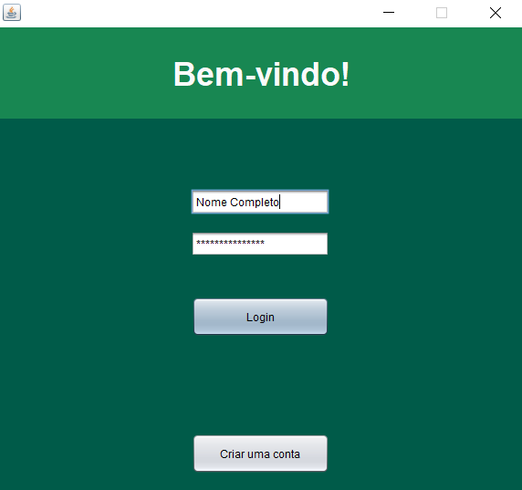
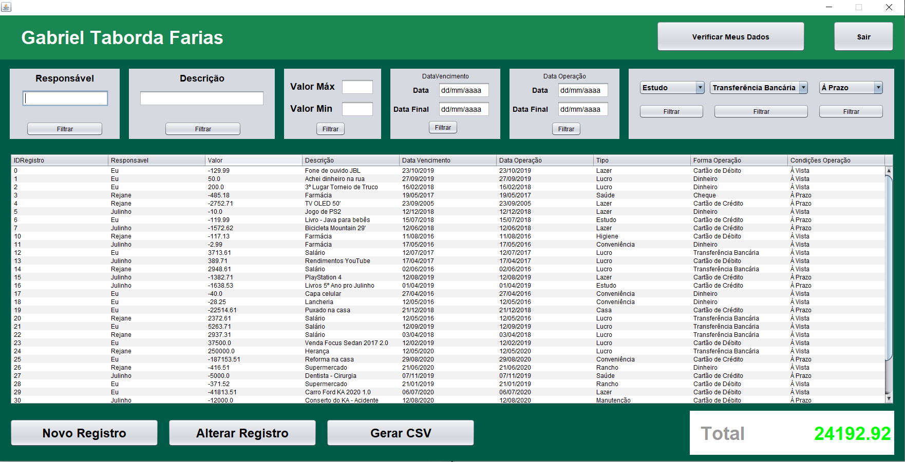
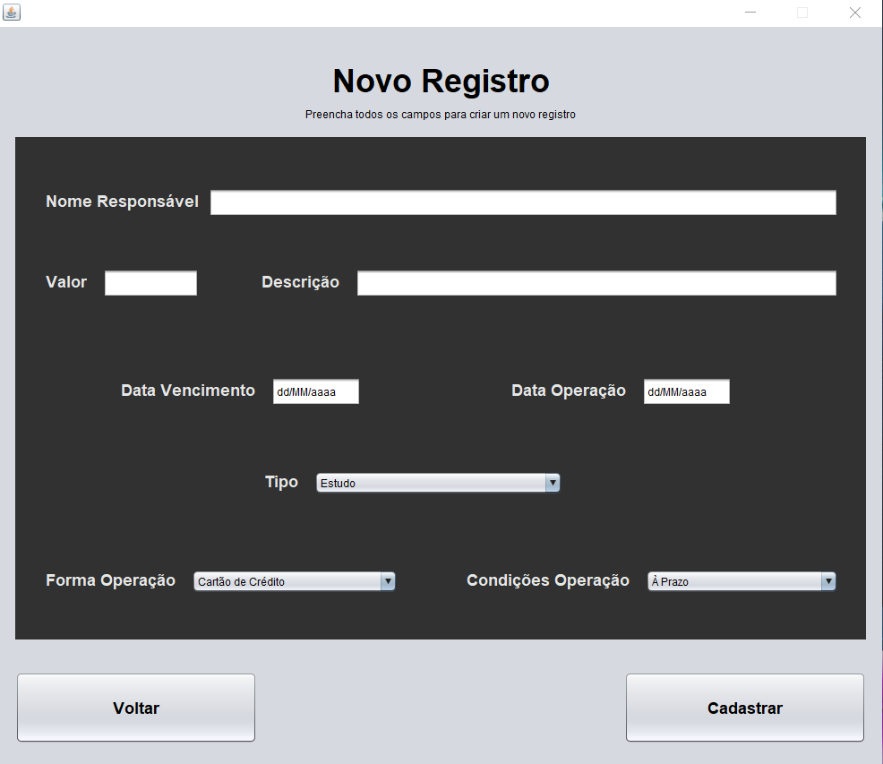
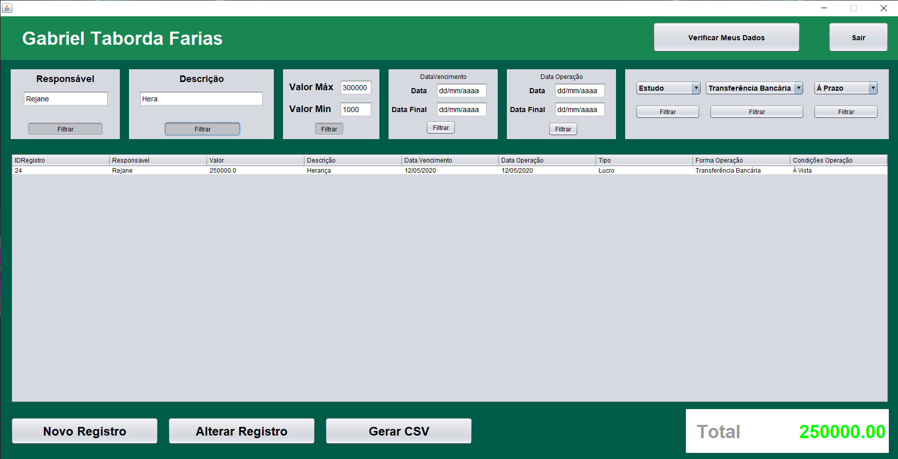

<h1 align="center">🧮 The good and old spends control 🧮</h1>

<h1 align="center">
 
 
</h1>

This project has been made for a work in the Computer Science course (Programming Language III) in the University (Universidade Regional Integral do Alto Uruguai e das Missões), from Santo Ângelo RS.

## Summary
* [About](%EF%B8%8F-about)
* [Screenshots](#%EF%B8%8F-screenshots)
* [Features](#-features)
* [Technologies](#%EF%B8%8F-technologies-involved)
* [Platforms](#-platforms)
* [Requirements to Run](#%EF%B8%8F-requirements-to-run)

### ℹ️ About
This is a basic project made to control and map, where the user's money is coming from or going to.

### 🖼️ Screenshots
<h1 align="center">
 
 
 
 
</h1>

### 🥏 Features
* You can use it offline, once the database is locally stored in .txt files
* Users can create different accounts for different purpouses
* Users can add/edit/remove every register in their account
* Users can search and map their spents by filtering the registers
  * Every time the registers table changes, the total value refreshes
* When user deletes himself, the same happens with all his registers, so, be warned
* Admin powers 🔧 (still building...) 🏗️

### ⚙️ Technologies involved
* [Java](https://www.java.com/pt_BR/) ☕

### 📵 Platforms
* PC only 🖥️

### ☑️ Requirements to Run
* Need to have installed the Java jre in your machine
* Need to have the db_users.txt and db_registers.txt on root path of the .jar executable file, and those database files must have the headers already set (these are already set actually)

